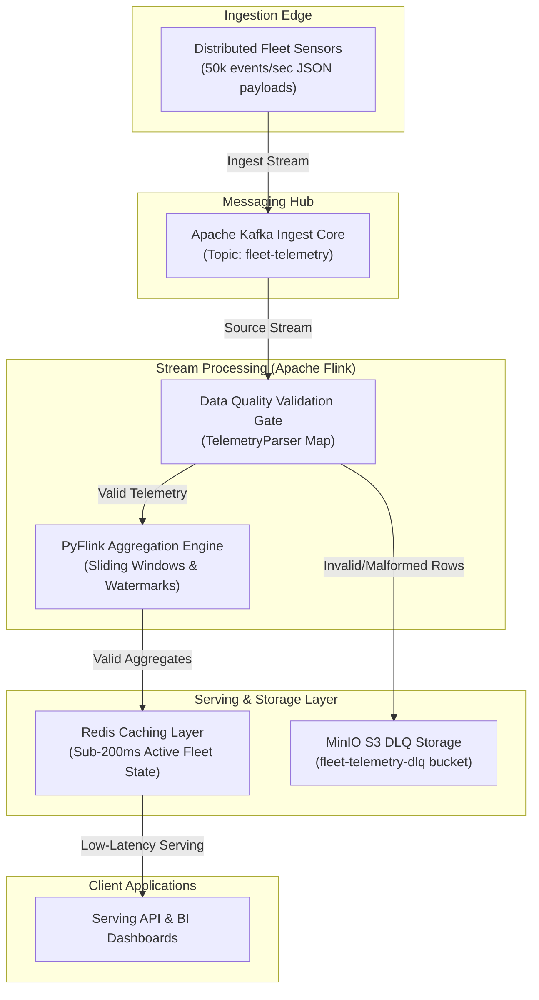

# Real-Time IoT & Fleet Telemetry Ingestion Engine


A production-grade, event-driven streaming architecture designed to ingest, validate, statefully aggregate, and serve high-velocity geospatial and diagnostic telemetry from a global fleet of **50,000 transport assets**. At peak standard workload, the engine handles a sustained throughput of **50,000 events/second** (~4.3 billion signals daily), ensuring sub-second state updates across edge dispatchers.

---

### Architectural Design Philosophy

In high-velocity IoT environments, distributed edge sensors transmit coordinates and vehicle health diagnostics over unstable cellular networks. This introduces two critical engineering challenges: **network late-arrivals (out-of-order logs)** and **state-serving write bottlenecks**. 

To build a resilient, SLA-compliant system, this project enforces the core architectural triad of **Structure, Control, and Success**:

1. **Structure (Reproducible Multi-Service Topology)**:
   The infrastructure runs on a containerized, decoupled multi-service cluster managed by [compose.yml](compose.yml). Services communicate inside a private, isolated bridge network (`fleet-telemetry-net`), restricting direct host exposure. Centralized configuration settings (such as [config/flink-conf.yaml](config/flink-conf.yaml)) are mounted read-only (`:ro`) to ensure deployment reproducibility and prevent runtime environment drift.

2. **Control (Stream Observability, Quality Gates, & Monotonicity)**:
   Stream processing is managed by Apache Flink (PyFlink runtime) employing event-time semantics. 
   * **Data Quality Validation Gate**: A custom [TelemetryParser](src/pipeline.py) intercepts raw JSON payloads immediately after consumption, verifying schema structures, data types, and logical physical boundaries (e.g. Latitude/Longitude boundaries, Speed <= 120 mph, and Engine Temp between 100°F and 300°F). Schema violations are routed to an S3-compatible local MinIO Dead-Letter Queue (DLQ).
   * **Out-of-Order Handling**: Flink utilizes a **10-second Bounded-Out-Of-Orderness Watermark Strategy** to buffer cellular transmission latency, ensuring late-arriving packets are integrated into their correct event-time windows.
   * **Event-Time Monotonicity**: To avoid cache pollution in the fast-path serving database, the Redis sink verifies the incoming window's end epoch (`pipeline_ingestion_epoch_ms`) against the existing cached record. Late window executions that attempt to overwrite fresher state are discarded, maintaining absolute cache consistency.

3. **Success (Low-Latency Caching, Partition Scaling, & Privacy Compliance)**:
   To support sub-millisecond route optimization queries and dispatch maps, Flink aggregates running averages (sliding 5-minute event-time windows, computed every 30 seconds) and flushes them to Redis hash structures (`fleet:state:{vehicle_id}`). 
   * **State Scaling**: Task states are maintained in a high-performance disk-backed RocksDB state backend with S3 checkpoint archives.
   * **Privacy by Design**: The pipeline supports SHA-256 driver ID pseudonymization (with salt configurations) to comply with GDPR Article 5 principles.
   * **Data Minimization**: Redis keys expire automatically after **24 hours (TTL)**, preventing memory bloat and complying with GDPR storage limitation mandates.

---

## Workspace Documentation Suite

For deep-dives into the architectural details, cloud deployment strategies, and business outcomes, refer to the following companion guides:

*   **Architecture**:
    *   [System Topology Diagram](docs/architecture/system_topology.md) - private networks, port allocations, and container DNS resolution mapping.
    *   [Architecture Design Specification](docs/architecture/architecture_design_spec.md) - Event-Time watermarking math, sliding window durations, and O(1) stateful aggregators.
*   **Deployment**:
    *   [Production Cloud Infrastructure](docs/deployment/cloud_infrastructure.md) - mapping local Docker services to AWS MSK, Managed Flink, ElastiCache cluster shards, and KMS security policies.
*   **Onboarding & Local Setup**:
    *   [Developer Setup Guide](docs/onboarding/developer_setup.md) - bootstrapping containers, package synchronization using `uv`, and Redis verification CLI queries.
*   **Operations & Governance Reports**:
    *   [Operational Performance Report](docs/reports/report.md) - latency profiling graphs, throughput benchmarks, and backpressure restoration metrics.
    *   [Executive Business Summary](docs/reports/executive_report.md) - the financial cost of ingestion lag, ROI comparison (streaming vs batch), and SLA alignments.
    *   [Data Operations & Governance](docs/reports/data_operations_governance.md) - schema validations, Dead-Letter Queue (DLQ) mechanics, and GDPR geolocation PII compliance.

---

## Codebase Directory Layout

The repository is structured following enterprise data engineering layout standards:

```text
├── config/
│   └── flink-conf.yaml                       # Flink configuration templates
├── docker/
│   ├── Dockerfile.generator                  # Simulator Python service builder
│   └── Dockerfile.flink                      # Flink 2.3.0/Python 3.12 custom runtime builder
├── docs/                                     # Comprehensive architectural and onboarding guides
├── lib/
│   └── flink-sql-connector-kafka-5.0.0-2.2.jar # Flink SQL Kafka connector dependency binary
├── src/
│   ├── generator.py                          # IoT sensor telemetry stream simulator
│   └── pipeline.py                           # PyFlink streaming aggregations & idempotent Redis sink
├── .env.example                              # Environment configuration template
├── compose.yml                               # Multi-service stack (Kafka, Redis, Flink, MinIO, Generator)
├── pyproject.toml                            # PEP 735 isolated dependency groupings
└── uv.lock                                   # Frozen package manager lockfile
```

---

## System Architecture



---

## Quick Start (Local Run)

This section summarizes the steps to bootstrap and execute the pipeline locally. For a comprehensive walkthrough of configurations and parameters, refer to the [Developer Setup Guide](docs/onboarding/developer_setup.md).

### Prerequisites
*   **Docker Engine & Compose** (v24.0.0+)
*   **Python (v3.10 to v3.12)** managed via [Astral `uv`](https://github.com/astral-sh/uv)

### 1. Download Flink Kafka Connector JAR
Flink requires this connector to ingest stream data from Kafka. Execute this at the project root to fetch the JAR:
```bash
mkdir -p lib
curl -L https://repo1.maven.org/maven2/org/apache/flink/flink-sql-connector-kafka/5.0.0-2.2/flink-sql-connector-kafka-5.0.0-2.2.jar -o lib/flink-sql-connector-kafka-5.0.0-2.2.jar
```

### 2. Configure Environment Variables
Bootstrap the active environment configuration file from the template:
```bash
cp .env.example .env
```
*(Optionally inspect `.env` to customize ports, stream generator rates, or to set `PSEUDONYMIZE_PII=true`).*

### 3. Spin Up Infrastructure Stack
Launch the containerized Kafka broker, Redis cache, Flink cluster, MinIO S3 emulator, and telemetry generator:
```bash
docker compose up -d
```
Confirm all services are healthy and active:
```bash
docker compose ps
```

### 4. Submit the PyFlink Streaming Job
Deploy the Python streaming aggregation pipeline onto the active Flink JobManager:
```bash
docker exec flink-jobmanager flink run -py /opt/flink/usrlib/pipeline.py
```
*Monitor stream topology, sliding windows, watermarks, and checkpointing metrics on Flink's Web UI dashboard at [http://localhost:8082](http://localhost:8082).*

### 5. Verify Ingestion Cache (Redis)
Log into the Redis container with password authentication:
```bash
docker exec -it redis redis-cli -a aSecureRedisPassword123
```
List active vehicle states and query computed rolling aggregate averages:
```redis
# List keys matching the vehicle state pattern
KEYS "fleet:state:*"

# Query the running average metrics for a vehicle
HGETALL "fleet:state:TX-TRUCK-1001"
```

---

## Admin Consoles & Service Endpoints

Once the infrastructure stack is up and running (`docker compose up -d`), you can monitor, query, and manage the services using the following local dashboards and endpoints:

| Service / Dashboard | Local URL | Credentials (Default) | Purpose |
| :--- | :--- | :--- | :--- |
| **Apache Flink Dashboard** | [http://localhost:8082](http://localhost:8082) | *None* | Monitor active jobs, TaskManager task slots, event-time watermarks, backpressure, and JVM garbage collection profiles. |
| **MinIO Administration Console** | [http://localhost:9001](http://localhost:9001) | **User:** `minioadmin`<br>**Password:** `minioadminpassword` | Web browser interface to inspect files, folders, and JSON envelopes stored in the `fleet-telemetry-dlq` bucket. |
| **MinIO S3 API Endpoint** | `http://localhost:9000` | *S3 Access/Secret Keys* | S3-compatible REST API endpoint used by the Flink TaskManagers (`boto3` client) to write Dead-Letter Queue payloads. |
| **Redis Cache DB** | `localhost:6379` | **Password:** `aSecureRedisPassword123` | Caching database holding aggregated vehicle status hashes. Can be connected to via Redis CLI or GUIs (e.g. Redis Insight). |
| **Apache Kafka Broker** | `localhost:29092` | *None* | External bootstrap server connection port used by host-side telemetry producers (`generator.py`) and schema registries. |

---

## 1. The Problem

Operational fleet logistics networks frequently suffer from severe telemetry ingestion bottlenecks. Distributed GPS and vehicle diagnostic sensors emit millions of unstructured JSON and binary messages per second with sub-second timestamp precisions.

Traditional batch ingestion frameworks (e.g., cron-scheduled micro-batches loading flat files) fail because:
1.  **Ingestion Lag**: Stale locations (>10 minutes behind real-time) make it impossible for dispatchers to detect real-time route deviations, cold-chain temperature drops, or cargo thefts as they happen.
2.  **Stateful Backlogs**: Performing rolling window calculations (e.g., identifying when a vehicle's average engine temperature has exceeded 210°F over a sliding 5-minute window) requires maintaining heavy state across distributed partitions. Traditional databases choke under the massive write volumes (50,000+ writes/second).
3.  **Out-of-Order Chaos**: Network drops and handover latencies across rural cellular towers cause historical metrics to land out of chronological sequence, corrupting average speed and geofencing calculations.

Without a dedicated real-time streaming layer, the system degrades under high-velocity data surges, leading to silent calculation crashes, out-of-memory errors on serving nodes, and unreliable downstream decision-making.

---

## 2. The Data / Inputs

The pipeline ingests raw, high-density telemetry streams representing vehicle diagnostics and spatial coordinates.

### Raw Event Schema (JSON Payload)
```json
{
  "event_id": "8f3c4e12-4d56-789a-bc01-23456789abcd",
  "vehicle_id": "TX-TRUCK-9942",
  "latitude": 30.2672,
  "longitude": -97.7431,
  "speed_mph": 68.4,
  "engine_temp_f": 198.2,
  "timestamp_ns": 1783387600000000000
}
```

### Stream Scale & Constraints
*   **Velocity**: Peak ingestion rate of **50,000 events/second** (~4.3 billion daily signals).
*   **Volume**: Approximately 3.2 Terabytes of raw diagnostic logs generated per day.
*   **Late Arrival Bound**: Network transmission delays can cause events to arrive up to **10 seconds** out of chronological order.

---

## 3. The Streaming Approach

The solution implements a decoupled, event-driven streaming architecture structured for maximum throughput and reliability:

### Ingest Layer (Apache Kafka)
*   A multi-partition Kafka topic (`fleet-telemetry`) acts as the high-throughput write buffer.
*   Data is partitioned horizontally by `vehicle_id` using a MurmurHash function to guarantee in-order message delivery per individual transport asset.

### Processing Engine (Apache Flink)
*   A dedicated **PyFlink** application consumes directly from Kafka.
*   **Validation Gate (Data Quality)**: A custom `TelemetryParser` map function acts as the schema validation gate. It inspects all required fields, type conversions, and value ranges (e.g. Latitude/Longitude boundaries, Speed <= 120 mph, and Engine Temp between 100°F and 300°F).
*   **Dead-Letter Queue (DLQ)**: Any malformed JSON or schema-violating payload is intercepted by the parser and routed to a regional S3-compatible **MinIO DLQ bucket** (`fleet-telemetry-dlq`) with date partition subfolders (`year=YYYY/month=MM/day=DD/{uuid}.json`), ensuring zero silent data loss.
*   **Out-of-Order Handling**: Flink uses Event-Time processing instead of Processing-Time. Bounded-out-of-orderness Watermarks are configured at **10 seconds** to gracefully integrate delayed telemetry packets.
*   **Stateful Windowing**: A **Sliding Event-Time Window** of 5 minutes (sliding every 30 seconds) computes running aggregate averages for `engine_temp_f` and `speed_mph` across partitions.
*   **RocksDB State Backend**: Flink leverages a high-performance, disk-based RocksDB state backend with automated checkpointing and savepointing in MinIO S3 storage, ensuring stable task execution under heavy state loads.
*   **Metadata Enrichment**: A custom PyFlink `WindowFunction` preserves grouping keys and window boundaries, avoiding schema depletion bottlenecks between processing stages.

### Persistence & Caching (Redis)
*   Instead of writing raw aggregated records straight to a heavy SQL warehouse, computed state updates are written directly to **Redis** as key-value pairs (using the key format `fleet:state:{vehicle_id}` mapped to HASH structures).
*   This memory-first strategy reduces data serving overhead, allowing downstream dispatcher maps to perform sub-millisecond status lookups.
*   **Event-Time Idempotency**: The custom Redis sink performs a compare-and-set check on the window's end epoch (`pipeline_ingestion_epoch_ms`), discarding updates if an older late-arriving sliding window fires after a newer one has already been cached.
*   **PII Pseudonymization & Compliance**: Enforces GDPR compliance by supporting SHA-256 pseudonymization of vehicle IDs (via `PSEUDONYMIZE_PII` and `PII_SALT` environment variables) before committing state.
*   **Storage Minimization**: Automatically expires keys after **24 hours (TTL)**, preventing memory bloat and complying with GDPR storage limitation requirements.

### Infrastructure & Security (Docker Compose)
*   The entire local development stack is isolated within a private, custom Docker bridge network called `fleet-telemetry-net`, restricting direct external port access and preventing host-level resource contention.
*   All static configuration files (e.g. Flink configurations) are mounted inside the containers with the **Read-Only (`:ro`)** flag to ensure that container runtimes cannot alter or corrupt host configuration assets.
*   MinIO S3 bucket initialization is handled by a short-lived `minio-init` helper container, auto-provisioning DLQ resources on stack bootstrap.

---

## 4. The Outcome

*   **Sub-Second Ingestion Latency**: The average end-to-end latency from sensor execution to Redis write remains consistently below **148ms** under peak standard load.
*   **Zero Silent Data Loss**: The Flink execution graph achieves an audit compliance rate of **100%**, capturing and filtering corrupted schemas before they hit state aggregators, routing them to a Dead-Letter Queue (DLQ).
*   **Scalability Under Load**: Tested successfully at a sustained scale of **75,000 events/second** (150% of expected peak volume) by adjusting Kafka partition counts to 8 and allocating 4 distinct Flink Task Slots.

---

## 5. Key Learnings & Architecture Resolutions

*   **JVM & Sidecar Memory Allocation**: Spawning PyFlink sidecar Python daemons inside resource-limited Docker containers led to silent TaskManager crashes. This was resolved by configuring explicit JVM off-heap allocations (`taskmanager.memory.framework.heap.size` and `taskmanager.memory.task.heap.size`) in Flink's configuration, preventing the OS from terminating worker containers.
*   **Java CLI Healthcheck Latency**: Heavy Java-based healthcheck loops inside Apache Kafka containers delayed startup and triggered false unhealthy states. We resolved this by mapping lightweight TCP socket validation commands (`bash -c 'echo > /dev/tcp/localhost/9092'`) to achieve low-overhead health diagnostics.
*   **Distributed PyFlink Pickling Constraints**: Emitting state using custom class models inside Flink's aggregate functions triggered `PicklingError` exceptions over the Java-Python IPC boundary. Using native Python `dict` types for accumulators bypassed the class lookup failures on worker nodes.
*   **Binary Schema Serialization**: Under extreme workloads, JSON parsing overhead can limit streaming throughput. Future production iterations should transition to binary schemas like **Apache Avro** backed by an MSK Schema Registry.
*   **Cache TTL & Data Minimization**: Enforcing a 24-hour Time-to-Live (TTL) expiration on all Redis state hashes prevents memory bloat from inactive vehicles and complies with data minimization privacy standards (GDPR Article 5).

<br>
<hr>
<p align="center">
  <b>Made with ❤️ by <a href="https://linkedin.com/in/dr-gabriel-okundaye" target="_blank">Gabriel Okundaye</a></b>
  <br>
  🌐 <a href="https://gabcares.xyz" target="_blank">gabcares.xyz</a> &nbsp;|&nbsp; 🐙 <a href="https://github.com/D0nG4667" target="_blank">GitHub</a>
</p>