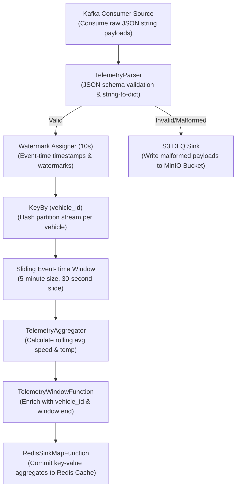

# Architecture Design Specification

This document provides a deep-dive technical specification of the distributed stream processing architecture, stateful sliding window semantics, and watermark configurations implemented in the Fleet Telemetry Ingestion Engine.

---

## 1. PyFlink Streaming Execution Graph

The processing logical graph flows through five distinct stages to parse, clean, partition, aggregate, and cache telemetry data:

---

## 2. Event-Time Processing & Bounded Out-of-Order Watermarking

Distributed fleet telemetry suffers from network drops and cellular tower handover latencies. This causes sensor data to arrive out of chronological order.

### Event-Time vs. Processing-Time
*   **Processing-Time**: The time recorded by the Flink TaskManager clock when it processes the event. This is highly unreliable because ingestion lag or server delays would skew rolling window calculations (e.g. calculating high speeds because multiple events got clumped together).
*   **Event-Time**: The time recorded by the GPS sensor itself when the event occurred (`timestamp_ns` mapped to `timestamp_ms`). This preserves the physical timeline of the vehicles.

### Watermark Mechanics
To process event-time, Flink uses **Watermarks** to measure the progress of time. A watermark is a timestamp that signals Flink that no further events older than that timestamp will arrive.
We configure a **Bounded Out-of-Orderness** strategy set at **10 seconds** (10,000ms):

$$\text{Watermark}(t) = \max_{e \in S}(\text{timestamp}(e)) - 10\text{ seconds}$$

Where $S$ is the stream of events processed so far.

*   If an event with timestamp `12:00:15` arrives, the maximum timestamp is updated to `12:00:15`, and the watermark progresses to `12:00:05`.
*   Any event arriving with a timestamp $\ge$ `12:00:05` is processed in its corresponding time windows.
*   If an event arrives late with a timestamp < `12:00:05` (exceeding the 10-second threshold), Flink flags it as "late data" and drops it from the window calculation, maintaining deterministic state boundaries.

---

## 3. Sliding Event-Time Window Mechanics

A sliding window of **5 minutes** (300 seconds), computed every **30 seconds**, computes rolling averages.

*   **Window Size ($W$)**: 5 minutes (300,000ms)
*   **Slide Interval ($S$)**: 30 seconds (30,000ms)

$$\text{Overlapping Windows Per Event} = \frac{W}{S} = \frac{300}{30} = 10$$

Each individual telemetry event falls into **10 distinct overlapping windows**. When an event is processed, Flink duplicates it statefully across these 10 windows. While this increases state storage requirements, it is essential for calculating smooth moving averages.

---

## 4. O(1) Stateful Aggregations

To prevent out-of-memory (OOM) errors under high ingestion volumes (50,000+ events/sec), we utilize Flink's `AggregateFunction` instead of a `ProcessWindowFunction` for the raw calculation.

*   **Inefficient List Buffer**: Storing all raw events for 5 minutes in memory and averaging them when the window fires. This requires $O(N)$ memory where $N$ is the number of events, leading to high JVM garbage collection overhead.
*   **O(1) Accumulator**: Our `TelemetryAggregator` maintains an active running accumulator consisting of three scalar values: `count` (integer), `sum_speed` (float), and `sum_temp` (float). 
    *   For each new event, Flink updates the running sums and increments the count.
    *   The memory footprint remains completely constant ($O(1)$) regardless of whether the window contains 100 or 10,000,000 events.

---

## 5. Serialization & Memory JVM Tuning

Converting JSON strings to Python dictionaries inside PyFlink requires inter-process communication between Flink's Java Virtual Machine (JVM) and Python execution daemons.

*   **IPC Overhead**: PyFlink runs a sidecar Python process to execute user-defined map and aggregation code. Flink uses a socket-based protocol to serialize and stream records back and forth.
*   **Memory Division**: Flink divides memory between the JVM Heap (used for state storage and coordination) and Off-Heap/Managed Memory (used for Python worker processes and buffer allocations). We configure explicit off-heap limits in `config/flink-conf.yaml` to ensure the host operating system does not kill TaskManager nodes during peak load spikes.

---

## 6. Event-Time Cache Write Idempotency

Even with Flink's bounded out-of-orderness watermarking, late telemetry updates can trigger older window calculations to fire. When writing these updates to Redis, an older window aggregation firing must not overwrite a newer window aggregation already written to the cache.

To enforce write idempotency at the persistence layer, the Redis sink implements a monotonic event-time guard:
*   **Unique Ingestion Epoch**: Every sliding window aggregate payload is enriched with a `pipeline_ingestion_epoch_ms` field representing the window's end boundary timestamp.
*   **Compare-and-Set**: When committing an update for a vehicle (e.g. `fleet:state:TX-TRUCK-1001`), the sink queries the existing cached epoch using `HGET`. The commit is executed only if the incoming epoch is strictly greater than the cached epoch.
*   **Stale Discard**: If the incoming epoch is older, the update is safely discarded as a stale late write, protecting the active serving cache from out-of-order corruption.

### Deduplication Paradigms: Exactly-Once vs. Idempotent Sinks

In distributed stream processing, achieving exactly-once processing guarantees at the sink layer can be solved using two distinct strategies:

1.  **Distributed Transactions (Two-Phase Commit)**: 
    *   *Mechanism*: Flink writes uncommitted records to a transaction-enabled sink (e.g. transactional Kafka producers). Transactions are committed only when Flink coordinates a successful cluster-wide checkpoint.
    *   *Trade-off*: Guaranteed Exactly-Once delivery at the cost of increased latency (equal to the checkpoint interval).
2.  **Idempotent Writes (Upserts / Compare-and-Set)**:
    *   *Mechanism*: Flink continuously writes records to the sink, but the destination database handles updates via deterministic keys or compare-and-set guards (like our Redis event-time check).
    *   *Trade-off*: High-performance, low-latency writes (sub-millisecond) without distributed transaction overhead. This is the optimal architecture for real-time dispatch and routing dashboards.

