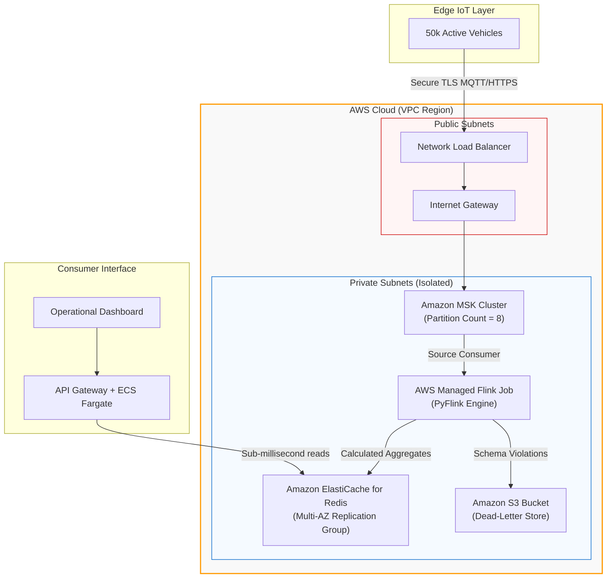

# Production Cloud Infrastructure Guide

This document details the production deployment architecture on AWS, mapping our local multi-service Docker Compose blueprint to managed, enterprise-grade cloud services.

---

## 1. Cloud Architecture Mapping

To support production-level ingestion rates of 50,000+ events/sec, we map the local Docker services to cloud-managed equivalents:

| Local Component | Production AWS Managed Service | Scaling Strategy |
| :--- | :--- | :--- |
| **Apache Kafka** | **Amazon MSK (Managed Streaming for Apache Kafka)** | Horizontal scaling via partition scaling and broker node resizing. |
| **Apache Flink** | **AWS Managed Service for Apache Flink (formerly Kinesis Data Analytics)** | Elastic autoscaling based on CPU utilization and backpressure metrics. |
| **Redis** | **Amazon ElastiCache for Redis (Cluster Mode Enabled)** | Master-replica replication across Availability Zones with auto-sharding. |
| **Docker Network** | **AWS VPC (Virtual Private Cloud)** | Isolation via private subnets, NAT Gateways, and security groups. |

---

## 2. Infrastructure Architecture Diagram

---

## 3. Network Security & Firewall Rules

All processing components are isolated within private VPC subnets. Communication is strictly regulated via Security Group policies:

1. **Amazon MSK Security Group**:
   *   **Inbound**: Port `9092`/`9094` (TLS) only from the `Flink Security Group`.
   *   **Outbound**: Port `0.0.0.0/0` (restricted to NAT Gateways for system updates).
2. **AWS Managed Flink Security Group**:
   *   **Inbound**: Port `8081` (restricted to VPN IP ranges for administrator console audits).
   *   **Outbound**:
     *   Port `9092`/`9094` to the `MSK Security Group`.
     *   Port `6379` to the `ElastiCache Security Group`.
     *   Port `443` to S3 VPC Endpoints for state checkpointing storage.
3. **Amazon ElastiCache Security Group**:
   *   **Inbound**: Port `6379` only from the `Flink Security Group` and `ECS API serving security groups`.
   *   **Outbound**: Disabled (no outbound traffic required).

---

## 4. Scalability & Performance Tuning

### Kafka Partition Tuning
*   Our raw Kafka topic `fleet-telemetry` is configured with **8 partitions** to parallelize ingestion.
*   Data is partitioned by `vehicle_id` using a MurmurHash partitioner. This guarantees that messages from the same vehicle are routed to the same partition, maintaining local chronological sequences.

### Flink Parallelism & Resource Allocation
*   **Parallelism**: Set to `8` to match the partition count of the Kafka topic. This allows Flink to allocate one consumer thread per partition.
*   **KPU Allocation**: AWS Managed Flink resources are measured in Kinesis Processing Units (1 KPU = 1 vCPU + 4GB Memory). We allocate 4 KPUs with autoscaling enabled to dynamically double capacity during peak morning dispatch rushes.

### ElastiCache Cluster Mode
*   Redis Cluster Mode is enabled with **3 shards** and **1 replica per shard** distributed across three Availability Zones. This guarantees continuous sub-second state lookups even during physical AZ server drops.
