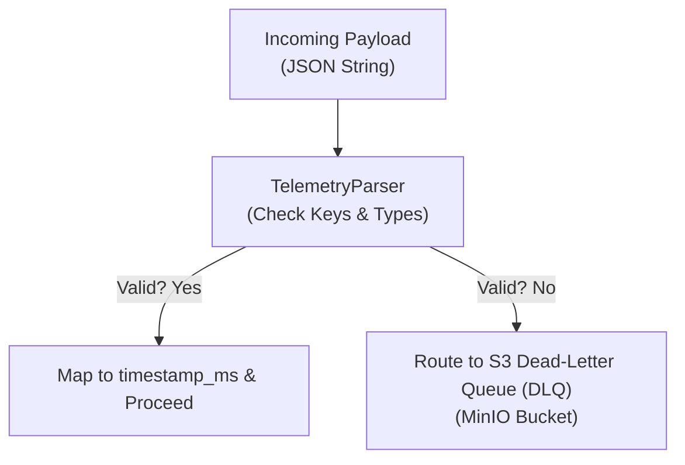
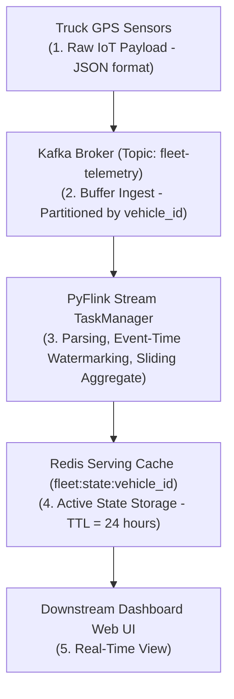

# Data Operations & Governance Spec

This document establishes the data quality validation rules, Dead-Letter Queue (DLQ) mechanics, lineage tracing, and privacy compliance guidelines (GDPR/PII) enforced across the Fleet Telemetry Ingestion Engine.

---

## 1. Data Quality Gate (Schema Validation)

To protect downstream processing states, the `TelemetryParser` acts as a strict schema validation gate. Every event parsed from the raw Kafka topic must satisfy the following validation checks:



### Required Fields & Bounds
*   `event_id`: Must be a valid UUIDv4 string (non-empty).
*   `vehicle_id`: Must be a non-empty alphanumeric string (e.g. `TX-TRUCK-1001`).
*   `latitude`: Float between `-90.0` and `90.0`.
*   `longitude`: Float between `-180.0` and `180.0`.
*   `speed_mph`: Non-negative float (clamped under `120.0` mph).
*   `engine_temp_f`: Float between `100.0` and `300.0` °F.
*   `timestamp_ns`: Unix epoch nanosecond timestamp (must be within the last 24 hours).

---

## 2. Dead-Letter Queue (DLQ) Mechanics

If an event violates any validation check or contains malformed JSON, Flink intercepts the record.

1.  **Detection**: The `TelemetryParser` flags the payload, catches parsing/bounds violations, and logs audit warnings.
2.  **Routing**: The stream execution graph handles failures gracefully. For local testing, validation-failed events are structured into audit metadata envelopes and written in real-time to an S3-compatible local bucket `fleet-telemetry-dlq` in MinIO using boto3 (partitioned as `year=YYYY/month=MM/day=DD/{uuid}.json`). *(Implemented in Code)*
3.  **Auditing & Alerts**: In production environments, malformed events are outputted to a dedicated Kafka DLQ topic (`fleet-telemetry-dlq`) for scaling. A serverless consumer writes these records to an Amazon S3 folder (`s3://fleet-data-governance/dlq/`), triggering Slack alerts for engineering review if DLQ rates exceed 0.5% of total stream traffic.

---

## 3. Data Lineage Mapping

Data lineage tracks the path of telemetry signals from edge sensors to serving caches:



---

## 4. Privacy & Compliance (GDPR Article 5 & PII)

Vehicle location coordinates (`latitude`, `longitude`) paired with a driver ID or vehicle registration constitute **Personally Identifiable Information (PII)** and are subject to regulatory compliance (e.g. GDPR Article 4).

To satisfy GDPR Article 5 Principles, we enforce the following data controls:

*   **Driver ID Pseudonymization**: Vehicle IDs are mapped to random SHA-256 hashes (pseudonyms) salted with `PII_SALT` when `PSEUDONYMIZE_PII=true` before executing Redis cache writes. *(Implemented in Code)*
*   **Geofence Anonymization**: Telemetry data used for long-term route analysis is anonymized by rounding coordinates to 3 decimal places, masking exact vehicle coordinates while preserving traffic flow statistics. *(Production Specification)*
*   **Data Minimization (Article 5(1)(c))**: Telemetry payloads are cleaned at the Flink ingestion boundary. Only the fields required for sliding average calculations are processed. *(Implemented in Code)*
*   **Storage Limitation (Article 5(1)(e))**: Location states do not persist indefinitely. We enforce a **24-hour expiration (TTL)** on all Redis state hashes. *(Implemented in Code)*
*   **Accuracy (Article 5(1)(d))**: Inaccurate or corrupted records are caught by the Flink parser validation gate and filtered to prevent downstream corruption. *(Implemented in Code)*
*   **Integrity and Confidentiality (Article 5(1)(f))**: Data is isolated inside virtual subnets (`fleet-telemetry-net`), cache reads require password authentication, and S3 checkpoint archives are encrypted at rest using AWS KMS Customer Managed Keys. *(Production Infrastructure)*


---

## 5. Right to Erasure & Crypto-Shredding Architecture

To comply with the **Right to Erasure (GDPR Article 17)** on immutable, append-only Kafka commit logs (where deleting single messages is impossible), the production roadmap establishes a **Crypto-Shredding Pattern**:

```mermaid
graph TD
    Driver["1. Driver Initiates Ingestion"]
    KMS["2. Fetch Unique Encryption Key"]
    Encrypt["3. Encrypt Telemetry Payload at Edge"]
    Kafka["4. Immutable Kafka Log (Encrypted)"]
    Decrypt["5. Decrypt in Flink for Window Aggs"]
    Request["6. Erasure Request (Right to be Forgotten)"]
    Shred["7. Shred Key in KMS"]
    Gibberish["8. Telemetry Data Permanently Unreadable"]

    Driver ──► KMS
    KMS ──► Encrypt
    Encrypt ──► Kafka
    Kafka ──► Decrypt
    Request ──► Shred
    Shred ──► Gibberish
```

### Engineering Implementation Rationale:
1.  **Unique Encryption Key Per Driver**: When a driver logs into the system, a cryptographic symmetric key is fetched from AWS KMS or HashiCorp Vault.
2.  **Edge Encryption**: PII coordinates and diagnostic attributes are encrypted at the simulator edge before being written to the Kafka topic.
3.  **Key Destruction (Shredding)**: When a driver exercises their right to erasure, their unique encryption key is permanently deleted from the key manager. The telemetry payload remains in the immutable log but instantly and irreversibly becomes undecryptable gibberish, satisfying GDPR compliance definitions for permanent anonymization without requiring log modification.

